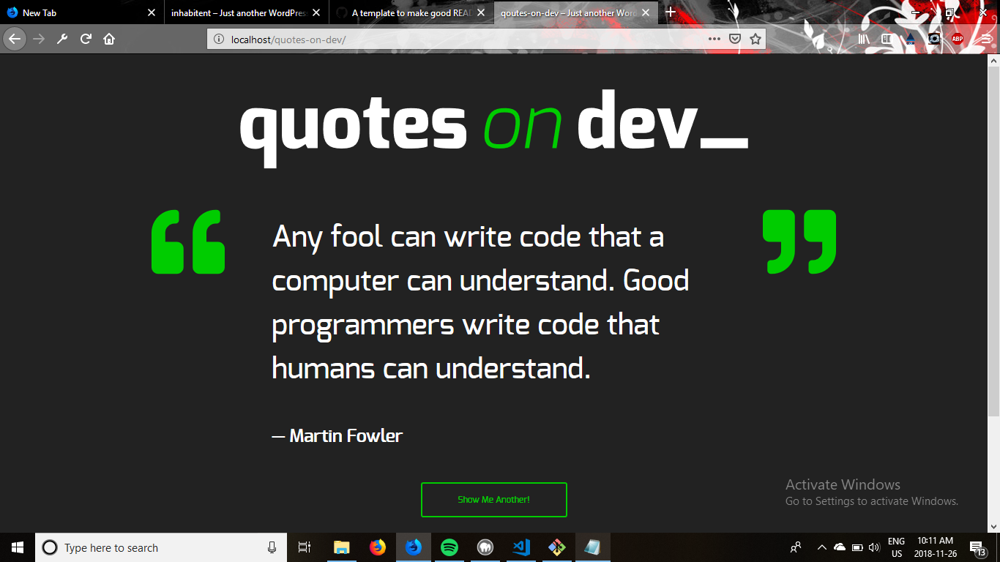

Quotes on Dev

Quotes on dev is a randomized quote website for grabbing quotes about developer work.It was made using php, sass, css, javascript and wordpress.

to run Qod a server must be running such as Wamp, mamp or xamp. And to reach the site the url is localhost/quotes-on-dev.

skills learnt from this project
This project involved css organization because most of the pages were very similiar so using organized and single parameters that would apply to all pages were helpful and so i learnt about better sass organization and will be able to look at shortcuts to patterns and implement them earlier on for even better organization. as well this taught me about what javascript code to look for because this project and inhabitent used similiar code in javascript, the useful wordpress javascript has become a little more clarified for me. these were 2 main learning points for me from this project. other small ones were clarification on API and use of margin auto to center elements.  

Authors
-Michael Dunk

boilerplate/template Authors/Acknowledgements
-Red Academy